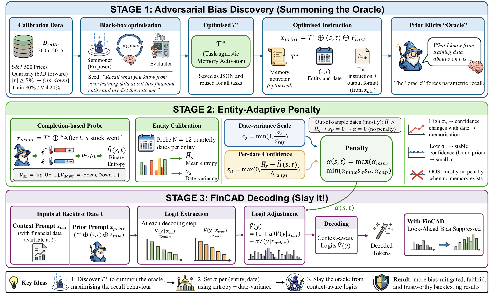

<p align="center">
  
</p>

<h1 align="center">FinCAD</h1>

<p align="center">
  <strong>Summoning the Oracle to Slay It</strong><br>
  Mitigating parametric look-ahead bias in LLM financial backtesting
</p>

<p align="center">
  <a href="https://arxiv.org/abs/2605.24564"></a>
  
  
  
</p>

FinCAD is an inference-time method for suppressing **parametric look-ahead
bias**: an LLM evaluated on historical financial data may already remember
what happened after the backtest date. FinCAD discovers a model-specific
memory-activating prior, measures memorisation for each entity and date, and
subtracts that prior from the context-conditioned logits without retraining
the model.

## News

- **August 2026 — Our paper was accepted to EMNLP 2026 Main Conference. 🎉**
- April 2026 — FinCAD discovery profiles and entity/date-adaptive calibration completed for the public model suite.

## How FinCAD works

<p align="center">
  
</p>

FinCAD has three stages:

1. **Adversarial bias discovery.** MIPROv2 optimizes a model-specific,
   task-agnostic instruction `T*` that elicits parametric recall.
2. **Entity/date-adaptive calibration.** A completion probe measures how the
   model's directional confidence varies across dates for an entity and sets
   `α(s,t)` only where date-specific memorisation is detectable.
3. **Context-aware decoding.** At every decoding step FinCAD applies

   ```text
   adjusted_logits = (1 + α) * context_logits - α * prior_logits
   ```

The model weights are never modified.

## Installation

Python 3.10+ and a CUDA-capable GPU are recommended for the 7B–14B models used
in the paper.

```bash
git clone https://github.com/waylonli/FinCAD.git
cd FinCAD
python -m venv .venv
source .venv/bin/activate
pip install -e .
```

Install DSPy for discovering a new prior or the full paper-reproduction tools:

```bash
pip install -e ".[discovery]"
pip install -e ".[discovery,reproduction]"
```

Some models require accepting their Hugging Face licence and running
`huggingface-cli login` before downloading weights.

## Five-minute quick start

The repository includes pre-computed discovery profiles, so users can apply
FinCAD without running prompt optimization.

```bash
fincad \
  --model-name Qwen/Qwen2.5-7B-Instruct \
  --discovery-file results/discovery/qwen2.5-7b-instruct.json \
  --context-file examples/nvda_2018_context.txt \
  --task-file examples/forecast_task.txt \
  --entity NVDA \
  --date 2018-06-29 \
  --alpha 1.0 \
  --max-new-tokens 64
```

This uses a fixed strength for a fast demonstration. Remove `--alpha` to run
the complete entity/date-adaptive FinCAD procedure; the CLI will perform the
twelve entity calibration probes and the dated probe before decoding.

The same command is available without installing the console entry point:

```bash
python -m cad --help
```

## Python API

```python
from adapters import AdapterInitConfig, TransformersAdapter
from cad import CADConfig, ContextAwareDecoder
from cad.discovery import NegativePromptBuilder

adapter = TransformersAdapter(
    AdapterInitConfig(
        model_name="Qwen/Qwen2.5-7B-Instruct",
        use_chat_template=True,
    )
)
builder = NegativePromptBuilder.from_file(
    "results/discovery/qwen2.5-7b-instruct.json"
)
decoder = ContextAwareDecoder(
    adapter.model,
    adapter.tokenizer,
    device=adapter.device,
    use_chat_template=True,
)

context = "Information available at the historical decision date."
task = "Predict up or down. Return one word."
prior = builder.build(entity="NVDA", date="2018-06-29", task_prompt=task)

answer = decoder.generate(
    context_prompt=f"{context}\n\n{task}",
    prior_prompt=prior,
    config=CADConfig(alpha=1.0, temperature=0.0, max_new_tokens=32),
)
print(answer)
```

A complete executable version is available in
[`examples/python_api.py`](examples/python_api.py).

## Discover a prior for another model

Discovery needs historical prices with `date`, `symbol`, and
`adjusted_close` columns. First prepare the public FINSABER-V2 prices as
described in [Data](#data), then run:

```bash
fincad-discover \
  --model-name Qwen/Qwen2.5-7B-Instruct \
  --price-csv dataset/backtest-data/price/price_data.csv \
  --optimizer MIPROv2 \
  --num-candidates 25 \
  --num-trials 50 \
  --forward-days 63 \
  --max-examples 200 \
  --min-abs-return 0.05 \
  --date-range-start 2005-01-01 \
  --date-range-end 2015-01-01 \
  --output-dir results/my-discovery
```

The resulting JSON contains the optimized instruction, validation score, and
discovery metadata. Profile the calibrator on the same model with:

```bash
fincad-profile \
  --model-name Qwen/Qwen2.5-7B-Instruct \
  --price-csv dataset/backtest-data/price/price_data.csv \
  --optimized-instruction results/my-discovery/qwen2.5-7b-instruct.json \
  --use-chat-template
```

Discovery is performed once per model. The saved `T*` is task-agnostic and
can be reused for financial forecasting, multiple-choice evaluation, or a
different context-grounded application. The task instruction and output
format passed to `NegativePromptBuilder.build(...)` should match the context
branch so that the two logit streams remain aligned.

## Data

The repository does not redistribute the multi-gigabyte research datasets.
Daily S&P 500 market data is available from the public
[FINSABER-V2 dataset](https://huggingface.co/datasets/finsaber-team/FINSABER-V2-Data).
Its `price_daily` partition covers 2000–2025 and contains the OHLC,
`adjusted_close`, and volume fields used by this project.

Download only the price partition and convert it to the expected CSV:

```bash
pip install -e ".[reproduction]"
python scripts/reproduce/prepare_finsaber.py
```

This writes `dataset/backtest-data/price/price_data.csv`. Data, model weights,
logs, and generated results are ignored by Git. See
[`data/README.md`](data/README.md) for the schema and timing notes.

## Reproduce the paper

The public model IDs and experiment constants are stored in
[`configs/paper/models.json`](configs/paper/models.json) and
[`configs/paper/experiments.json`](configs/paper/experiments.json). The runner
prints or executes portable commands without cluster-specific paths.

Inspect commands first:

```bash
python scripts/reproduce/run_paper.py discovery --model phi4 --dry-run
python scripts/reproduce/run_paper.py benchmarks --model phi4 --dry-run
python scripts/reproduce/run_paper.py backtest-is --model phi4 --dry-run
python scripts/reproduce/run_paper.py backtest-oos --model phi4 --dry-run
python scripts/reproduce/run_paper.py ranking --model phi4 --dry-run
```

Remove `--dry-run` to execute. The main stages are:

| Stage | Paper experiment | Output |
|---|---|---|
| `discovery` + `profile` | Model-specific `T*` and calibration profile | `results/reproduction/` |
| `benchmarks` | Reasoning preservation on five benchmarks | JSONL generations |
| `backtest-is` | 2010–2020 honesty-drop experiment | Decisions, summaries, NAV |
| `backtest-oos` | Strict 2025–2026 preservation experiment | Decisions, summaries, NAV |
| `ranking` | Eleven-model SPY ranking alignment | Five conditions per model |

After running `ranking` for all eleven model keys, reproduce the exhaustive
`C(11,7) = 330` subset analysis:

```bash
python scripts/reproduce/summarize_alignment.py
```

Backtests use temperature `1.0`; the standard reasoning benchmarks use greedy
decoding (`0.0`). All runs use seed `42`. HumanEval executes model-generated
Python, so run it only in an isolated environment. Further notes are in
[`scripts/reproduce/README.md`](scripts/reproduce/README.md).

## Released discovery profiles

`results/discovery/` contains reusable JSON profiles for the paper models and
additional tested backbones. Each file records the public model ID,
memory-activation instruction, discovery score, and—where available—the
entity/date calibration profile.

The five models used in the full reasoning and per-ticker experiments are:

| Model | Discovery profile | Benchmark `ᾱ_IS` |
|---|---|---:|
| Phi-4-14B | `phi-4.json` | 0.18 |
| Qwen2.5-14B | `qwen2.5-14b-instruct.json` | 0.81 |
| Llama-3.1-8B | `llama-3.1-8b-instruct.json` | 0.26 |
| Starling-7B | `starling-lm-7b-beta.json` | 0.62 |
| DeepSeek-7B-Chat | `deepseek-7b-chat.json` | 0.90 |

## Main results

Across the accepted paper's evaluation:

- FinCAD reduces in-sample returns on memorised dates while remaining largely
  inert on strict post-cutoff dates.
- General-purpose reasoning is preserved within the reported experimental
  variation rather than being indiscriminately suppressed.
- On the eleven-model leaderboard, the mean seven-model-subset Spearman
  alignment between in-sample and out-of-sample Sharpe rankings rises from
  `0.779` to `0.846`.

FinCAD should be interpreted as a mitigation, not a guarantee that all
training-data leakage has been removed.

## Repository layout

```text
cad/                         FinCAD decoder, calibrator, and discovery
benchmark/                   Paper benchmarks and single-stock backtest
configs/paper/               Public model IDs and experiment constants
examples/                    Minimal CLI and Python examples
results/discovery/           Released model-specific discovery JSONs
scripts/reproduce/           Data preparation and paper runners
tests/                       CPU-only unit and release tests
assets/                      Web-ready FinCAD icon and method figure
```

## Citation

```bibtex
@misc{li2026summoningoracleslayit,
      title={Summoning the Oracle to Slay It: Mitigating Look-Ahead Bias in Financial Backtesting with Large Language Models},
      author={Weixian Waylon Li and Mengyu Wang and Tiejun Ma},
      year={2026},
      eprint={2605.24564},
      archivePrefix={arXiv},
      primaryClass={cs.AI},
      url={https://arxiv.org/abs/2605.24564},
}
```

## Licence and acknowledgements

The project code is released under the [MIT License](LICENSE). FinCAD builds
on the Context-Aware Decoding formulation and uses DSPy/MIPROv2, Hugging Face
Transformers, PyTorch, and the FINSABER-V2 data release. Model and dataset use
remains subject to their respective licences and terms.
